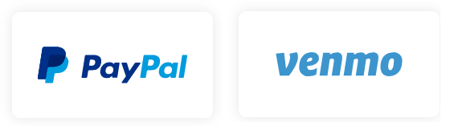

We are living in a technology-oriented world where millions of money are
processing online in every second. To fulfill the need of this market,
mobile payment technology took birth. There are no standard API in
mobile app development, we have the number of providers and number of
platforms which are still growing. The objective of this paper is to
explore the history and future of mobile payment along with the APIs
provided by different vendors. This report is generated by exploring
different researches and documentation provided over the internet.
The explanation is given with the help of developing a demo application with
mobile payment capability. The findings of this report will give a better
understanding to software developers in terms of choosing the mobile
payment service developed by different third parties. The conclusion tells,
that the paper will provide a vast explanatory explanation with a
simplified wording, although more research is needed.

Introduction
============

Mobile payments (includes Mobile wallet and Mobile money transfers),
which are also known as m-payment, can be defined as a payment method
in which we involve a portable device like mobile or tablet to pay the
money in exchange for services or products. Mobile payment can also be
used to send or receive money to pr from your friends and family. Mobile
payment is gradually growing technology at a tremendous rate because
almost all the financial institutions around the globe are adopting
mobile technology for the debit and credit of money belong to their
customers. Most of the banks have introduced different mobile applications
for their customer, through which they can perform online transactions
from their handheld devices. What is Mobile wallet:- The mobile wallet is
basically a digital wallet, all you need is to download the mobile
wallet app into your mobile phone and add your credit card information.
No after the authentication you are authorized to make payment through
mobile without the involvement of hard cash or cheques. The technology
which will allow the mobile wallet to perform the transaction is called NFC
(near field communication). NFC is a technology that enables your mobile
to communicate with the payment reader to perform the payment. Examples are
Apple Pay or Samsung Pay. What is a mobile money transfer? this is
basically a payment method in which we transfer money through some
mobile application or third party service integrated into some application
to some business or person. Examples are PayPal or WeChat. Let’s move
forward to see some statistics related to mobile development.

Statistical Data
================

Here we will discuss statistics about multiple types of research carried
out in terms of examining the mobile payment market.

Statistics of Global Mobile Payment Spending
--------------------------------------------

According to the study that has been published by Goldman Sachs in the
The year of 2013 shows the bright future of mobile payment technology with
the wast case study, interesting statistics, and growing trend.
@GoldmanSachs Below is the given figure which is showing the increase in
a very detailed manner.


As you can see the Global market overview in fig 1.1 in which it is
more precisely explained about the scenario, how the people around the
world spends billions of dollars to perform the mobile transaction in
term of money. This study covers all the aspects and shows all the
Options that, in which the area users spend more money on mobile technology.
we can see the study covers merchandise purchases, Ticketing, Money
transfer, bill payments, airtime top-ups, and other spendings. But most of
the users were bend towards merchandise purchases and money transfers.
This case study shows the statistics in 2013 but it shows the future
till 2017, despite all the dates mentioned here, today in 2019, we
have much more money, that has been spent by the users all around the world
and this is still growing and expanding.

Mobile Money
------------

Mobile Money is the future of the modern world, where not only your
money but everything is going to be a shift in your hands. Here we need to
consider one thing that These technologies cannot unless the government
of that particular area supports it. Nowadays the Government are also
moving towards the E-Governance therefore they encourage the steps taken
for technological enhancement. Here we will explain this scenario
with figure how this technology is attracting people towards itself.


The given fig is also taken from the “Goldman Sach” research which is
clearly representing the scenario of today’s Mobile technology growth.
As we can clearly see how the Mobile money is distributed in
different channels and how users are interacting with those channels to
fulfill their needs in terms of mobile payment technology. Here we are
going to explain all the topics one by one.

### Mobile Banking

Mobile Banking is a Present and future trend for all of the financial
institutions. Nowadays every user want to control all of his
belongings with the mobile or device which is in his hand. Bank Account
of the user will be top of the list, where the user really wants to have
full control on his money and he can perform any transaction over it
within a seconds. No matter what’s the location of that person. It will
also save time by going to the bank and follow different steps just to
perform one transaction. Therefore most of the banks have been
introduced mobile banking because they also don’t want to lose
their customer just because of the technology switch. Now we have the
possibility to control our bank account through our mobile phone or
tablet (handheld device).

### Mobile Payments

The other aspect of Mobile is the for Mobile payments which can be
within-person to person (P2P) or business to business (B2B), this can be
the sending and receiving of money between the nodes. In today’s world,
mobile money is used within the businesses to carry out different tasks
and as this process is very fast therefore the stakeholders prefer this
method. Mobile payments are also internally connected with Mobile
commerce.

### Mobile Commerce

The third and very famous aspect of Mobile money is Mobile commerce, in
which the user pays against the service or goods. Almost all of the
e-commerce websites are providing mobile payment methods otherwise
they will lose the users. Because most of the users are dependent on
mobile payment.

Mobile Money on the broader Scale
---------------------------------

If we see on the broader scale that how the Mobile Money is connecting
three main stakeholders like customers, Merchant, and Government, all are
interconnected through this whole broad infrastructure of the
technology. All the stakeholders are depending on the mobile money to
get benefit from each other and to build the economy.

Statistics of Users on different Mobile Spending Platforms
----------------------------------------------------------

Now we are moving forward to the users and look into the market about
the platforms, and which platform has how many users. Here we are going
to take the example of one more research study about the statistics.
Here is the fig which is going to give the overviews of the user’s
statistics worldwide.


Given fig is basically taken by a research study published by Juniper
Research @JuniperResearch. This statistics fig is covering almost all
the well-known market technological giants who are supporting mobile
payments. It is showing you the number of users in millions around the
world who are using different mobile payment platforms to perform the
money transactions. For example WeChat, Alipay, Paypal, Samsung Pay,
Amazon Pay, Chase Pay, and Android Pay, etc. WeChat, Alipay and Paypal are
the top-rated giants and are covering most of the users around the globe,
but the others want to stay and compete in the market with these
giants that’s why they also introduced their own payment methods for the
mobile users.

Current and Future Statistics
-----------------------------

Let’s talk about the future of mobile payment technology. As we already
discuss some research studies from the past year which were
showing the current market span of this technology. Now it’s time that we
should also know, how this technology is treating with its growth in the
future. Here we will pick one more top-rated research which was
published by top-rated Zion Research center. According to that research,
Global market payment technology market will reach **USD 3,371 Billion**
by **2024**@Zion. This research has been produced on the basis of
The current scenario and past growth rate. The final value was taken as
sixty percent of CACR (compound annual growth rate). This is the reason
this technology has a very bright future ahead. The market span of mobile
payment technology is in billions that’s why this technology has worth
standing beside other giant technology in the scientific world.

The rapid growth of mobile payment technology vendors
-------------------------------------------------

As the worth of mobile payment technology is increasing, therefore
stakeholders of the technological world are also wanted to be updated
towards the technologies, therefore almost all of the top market giant
in the scientific-technological world are investing to be the partner of
this technology. Because of this participation, they can increase their
market shares and earn billion of profit. If they don’t want to update
themselves then they will lose the competition against other markets
giants.


Here in fig 4 you can see that, we have multiple options to use the
services of mobile payment, because vendors are greater in number.
Almost all the top brands are on the list. Which is a clear example that
if a business wants to stay in the market then that business should
update itself with the market trends like today’s mobile payment
technology.

Follow the Market trends
------------------------

Here we are going to discuss the importance of following the trends in
The market. If a business wants to stay in the market then it needs to
compete with its competitors and provide the product which is according
to the customer need. I am taking the example of NOKIA failure. Nokia
was the market giant in the smartphone industry till 2007 but after the
launch of the iPhone and ANDROID, Nokia market shares start decreasing till
the company CEO announce that “We do nothing but we loose”@nokia. why
they lose the competition with the competitors because they did not
follow the market trends to provide a nice User Experience. Therefore it
is important for every business to keep itself updated with the latest
technology in order to become profitable that’s why we have a lot of
vendors in mobile payment technology. They already learned the lesson
from the Nokia downfall.

Related Work
============

We have discussed about the evolution of mobile payment technology, now we
are moving towards the famous Api’s which are supported by different
vendors. There are too many Api’s from different provides, but we will
only discuss some of them which are most famous among the developers.
First of let’s talk about Paypal rest API.

PayPal
------

Paypal Holdings, inc. is basically an American company which is
supporting online money transfer through your online PayPal account.
Through Paypal Mobile application you can easily perform money
transactions from your mobile or tablet. you can attach your bank
account with your PayPal account as well, this is very famous in users
because of its ease of use. You can say that it acts as a virtual
wallet for you. Most of the top-rated websites are allowing you to pay
through PayPal, therefore PayPal has a nice coverage span over the
e-commerce industry. Here one question arises, why e-commerce websites
allow you to pay through PayPal because PayPal provides easy support
and free of cost for the developer to incorporate their services on
their website without any extra cost. Here are some facilities which are
covered by PayPal@PayPalAgreement:-

1.  Send or receive payments for online actions at eBay and other websites.

2.  Purchase and selling of goods and services.

3.  Make and receive donations.

4.  Exchange cash with someone.

### PayPal Rest API

The PayPal API’s are Restful HTTP Api’s that are using OAuth 2.0 for
authorization. The most attractive part of this API is this, that you
can request and receive the data in the form of JSON which is a standard
format for the API. Let’s explain the whole process of transaction
execution with the help of diagram@PayPal.

Fig 5 which is given below, shows how a transaction executes in the
PayPal case. First of all your site makes a request to the PayPal API to
make the desired amount of payment transaction. After verifying that
request, in response to that call to the Paypal, the user will be redirected
to the login page of the Paypal. Now the user needs to provide the
credentials on for the Paypal account in order to make the transaction
successful. When the user presses the login button after the user email and
password, PayPal will confirm that whether any user with the given email
and password exist or not. If Paypal Confirm the authentication, the
next step is authorization, for the authorization your PayPal account
needs to have the requested money in credit otherwise your transaction
will be failed and you will be shown with an informative message you
recharge your account. If your account has enough money which is
required for the transaction then you will be asked to confirm the
payment and upon the confirmation of the successful transaction, you got a message on the requesting site screen@paypalJornal.


### Sandbox Testing of PayPal

Paypal Provide a Sandbox testing service which is very useful for the
developers while integrating the Paypal into your Mobile application,
website or any other kind of software where the money is involved. Here we
will go through the requirements to perform sandbox testing and later in
the article we will create an application in Android platform and
integrate the Sandbox testing accounts to check the money transactions
through mobile payment. For sandbox testing, first of all, you need to
register yourself with Paypal developer account which is also known as
Sandbox account, Then you need you to register your application in the
Paypal developer in order to get Business account key which you can
integrate with your application while calling the Rest API of Paypal.


Fig 6 is showing the glimpse of Sandbox accounts provided by Paypal
where facilitator account act as a business account and buyer account as
a test user account.

### Business Account

Business Account is generated after register your application in
developer platform, The key which is given along with business account
can be used for the transactions. This key represents, that when you will
make some transaction from any PayPal account then money will come into
your business Account.


In the given Fig 7 we have a create API in Paypal developer account, and
along with this API, we get a clientID which we will use in our
application development environment to receive the payment in our
business account.

### Test Account

Buyer in the scenario, who pays money. The sandbox provides you a test
account through which you can perform the dummy transaction. These
transactions will not credit your Business account money, but it will
show that the transactions happened. Paypal gives you 10000 Euro as welcome money in test account which you can use for testing the
transaction. Later it can be extended upon the request. This welcome
money is just dummy money, This is not real money.

Braintree SDK
-------------

Braintree also belongs to PayPal, this service is more vast and also
provided with the back support of PayPal. This SDK has over 250 million
customers and more vastly used in the payment industry especially in
The e-commerce sector. It is available for both mobile and web, therefore,
consider more flexible. The most important aspect of this SDK is that
it provides different debit and credit cards, Paypal and PayPal Credit
with the integration of single Braintree API. Braintree is the mixture
of multiple payment methods, which is not only supporting the payment
through PayPal account but also from different Credit and Debit Card
providers. Let’s Talk about different services that are provided by
Braintree SDK are as follow @Braintree.

### Checkout Service

It provides already developed and very attractive UI for the checkout
through your mobile app, therefore you can reduce your workload for
designing the Checkout layout for the mobile application. On the other
hand it also gives the flexibility for the crazy programmer to design
your own checkout UI with the SDK integration.

### Reach More Buyers

According to the study about the online e-commerce mobile orders, About
40percent of the buyers are using PayPal while checkout so therefore it
will definitely increase the business of the Mobile App if they have
Braintree or PayPal API integrated for the payment method.

### Supported Payment Method

This one of the most important aspects of this SDK that it has multiple
payment methods therefore we can grad a lot of use with different
payment providers. First of all, it is supporting the most popular are



Credit and Debit cards, supported by Braintree SDK are:-


Digital Wallets which are in the supporting list of Braintree areas
follow:-


Local payment methods in the Braintree SDK are:-


### BrainTree Sandbox testing

Braintree is also providing Sandbox testing, which includes varieties of
payment methods during the testing transaction, therefore in Sandbox
testing Braintree facilitates the developer with a number or test
accounts, like credit and debit card numbers which can be used for dummy
transactions.

### White-Glove Support

Braintree SDK provide very unique support, in which you can talk a
real person from the Braintree team to resolve your issues. This
approach termed as white-glove support.

SQUARE
------

SQUARE, Inc is also a mobile payment company which is based in San
Francisco California. The company not only providing mobile payment
services but also financial services and merchant services.@Square

### How Square works in Mobile payment

Square allows the people in business like a merchant who wants to charge
money from there customers through credit or debit card, Square comes in
action to accept the debit or credit card with a plastic dongle which
can be inserted into the Audio port of mobile and Customer just need to
swipe his card from the dongle. Square is also charging for each
swipe, customer made. The dongle can be seen in the given fig.


Square gives merchants and individuals to accepts the offline debit and
credit cards through their Android and iOS smartphone or tablet
computers.

### SDK and API’S services by Square

Square provides multiple numbers of SDK and Api’s to facilitate the
customers, Square has millions of customers around various countries
including United States, Canada, Japan, Australia, and the United
Kingdom. Square reader SDK and Square Apis are very easy to integrate into
your application. Developers like to embed the square SDK and API because
it has very nice, clean and informative documentation which guides the
clear logic to integrate this technology.

### Reader SDK

The basic idea or Square reader is this, that it facilitates the merchant
or individual to receive in-person payments. Now square has multiple
hardware from which Square Reader is one. For Square reader you need
SDK which will be acted on your behalf to receive the payment into your
account. Reader SDK compose of Mobile Authorization API and Transaction
API. This SDK enables developers to integrate square checkout flow and
accept in-person payment in your own custom to build a mobile application. we
use square readers with NFC payments. The SDK provides authorization,
transaction processing, and reader management. Square reader hardware can
also be seen in the given fig


When the user will come, it will just swipe his card in the reader, the
reader is configured to your custom application in your mobile or
computer, and you will receive your payment in your account. Users can
also pay their money through Apple pay or Google pay.

### Customer API

This API is an extra service from the Square, in which you will not
receiving money from your customers but also you will manage their data.
It will store the information related to all your customers in your
database which is very helpful in order to manage the customer data.
The whole process is shown in fig.


This time-lapse is showing, that how can you store the save the data of
your customer upon the request of making the payments. If a merchant
wants to have information about all his customers, then he can embed this
API in his application. This application is also very supportive in
terms of integration like others.

### Catalog API

This is also an extra and supportive API besides your payment API. It
will create and maintain the product catalog and all products which are
linked to that product. The product then used for performing payments.


### In-App payments SDK

In-App SDK is the same as PayPal service, which you can integrate into
your mobile application. You just need to attach your Business Id within
the back-end while calling the payment service. During the user payment,
it will direct to the payment screen, where the user will enter its credentials
and submit the payment. When payment has been done successfully the
merchant will receive that payment in his own account.

Secure In-App Payments supports both Android and iOS Platform and it is
very easy to integrate. If you are planning to develop the Android, iOS
or Cross platform-dependent App, In-App SDK has nice sample applications
and helping code on the documentation. You can easily access it and use
it in your custom developed application. To embed this SDK in your
application, you must register first and then you can have Application
and Location ID which you can use in your application for the
integration. It will represent your account associated with the
application.

### Point-of-Sale SDK

This is a very efficient and supporting service, which is provided by
the Square, in which the user can have hardware and SDK support for the
point sale. This whole system can be accessed by your mobile device.
The payment you received by the POS hardware can be manageable by your
smartphone. This respective point of sale hardware is shown in the given
fig.


This diagram shows the flow of creating the product catalog, which is
also helpful while getting your payment in exchange the product during
point of the sale process.

Stripe
------

Stripe is another technology company that is a supporting hand for the
receiving of mobile payments over the internet. Stripe is very popular
among developers because it is not online providing payment services but
also prevents the transaction from technical or fraud issues. In Stripe
the whole banking infrastructure is required to operate the on-line
payment systems. Strip support multiple payment methods, e.g. BanContact,
Giropay, iDEAL, SEPA Direct Debit, Sofort, AliPay, WeChat Pay, EPS,
Multibanco, PS4, etc. Stripe accepts all major debit and credit cards
including VISA, MasterCard, AMERICAN EXPRESS and 3DS, etc, in 130+
currencies. Therefore stripe is more favorite in growing your business
because your business has a vast payment acceptance option which will
attract more customers@Stripe.


In the given fig you will get a basic idea, that how stripe works, When
A customer hits the Stripe API to pay the money, it will send a request with
payment info, which hold user credentials for stripe, In response,
Stripe will generate and token and send back to the requesting client
app, the client then sends that token with other required data to your
application server. Your application server then charges the amount from
the client account using that token. Stripe is also not limited to
mobile payments only. Just like other Mobile payment giants, Stripe is
also providing multiple services where are as follows @StripePaper.

### Payment SDK

Stripe is providing Payment SDK for Android and iOS, which will be
needed to integrate into our mobile application in order to carry out
the transactions through Stripe. Stripe is also providing a customer user
interface including embedded checkout which is very helpful for the fast
development of the application. But the developer can also do the custom
development of the user interface. This Payment SDK has multiple payment
options like Cards, wallets, local payment methods, currencies, and
subsidiary support. Payment SDK using different security protocols and
custom-developed applications like Stripe radar, 3D Secure, dispute
handling in order to prevent the transactions from fraud and disputes.
Here in the given diagram, you will get the basic idea or whole structure
of the Payment Service of Stripe.


### Stripe Api’s Varieties

Stripe’s API has various libraries in multiple programming languages,
every single one has a lot of specifications like server-side libraries
in Ruby, Python, PHP, Java, Node.js, Go; and libraries in other
operating systems like iOS and Android. Stripe provides third-party
plugins for content management systems
like Joomla, Drupal and Wordpress and e-commerce platforms
like PrestaShop, Magento, and OpenCart. Stripe’s API is very popular
among developers because of a lot of services in terms of mobile user
experience. It recently launches the set of APIs known as Relay, which
is a solution that can penetrate into smartphones and the vastly
used e-commerce purchases from those devices.

Dwolla
------

Dwolla is also a payment company that provides online payment system
and mobile payments network. It has been active in the US since 2010 but its
business is growing day by day.

#### Why Dwolla is different from others?

Because it is a middle layer between the Banks and the customers. When
you integrate Dwolla with your application, all the users who want to
initiate the payment, they will first verify their bank account through
Dwolla Secure Application programmable interface@dwolla.

### Services Given by Dwolla

When you will integrate the Dwolla in your application, then your user
will log in to your application through your own defined parameters,
After getting a login, he can perform transactions in terms of money from
his mobile application. But first of all, he should verify the Bank
Account. You don’t need to worry about that, Dwolla will take care of
this verification process. Dwolla allows your application to verify the
customer bank account quickly. After that, your customer is allowed to
make payments.

#### Dwolla allows you to send 5000 payments with single API request from your mobile

### Dwolla Sandbox testing


Dwolla also provides the customer to test their API through Sandbox testing
The same as other APIs. First, you need to register for the account and
then take a unique key from that account which will be used within your
application for the transactions. You get a test user account, which
facilitates in terms of making test transactions.

implementation
==============

Here we will demonstrate the use of payment API in a mobile application
in terms of applying successful Payment transactions through Mobile. We
will demonstrate all the tools and technologies which will be used in
the mobile application. For this test application, we have chosen
The following tools and technologies.

1.  Android OS.

2.  PayPal SDK.

3.  Android Studio.

Now we will explain the mobile payment through the demo application
which we have developed.

Demo Application
----------------

We have developed this demo application for the Android environment. Android
is a very famous mobile operating system, which has been developed by
technology Giant “Google”. Most of the famous mobile companies Samsung,
Huawei, Sony, Oppo, and Nokia are using Android in their mobile devices.
Android is very user friendly and enhances the customer experience by
multiple extra services supported by Google from which the most popular
service is Google Maps.

*Android is the best selling operating system since 2011 and has almost
2.6 billion monthly active users.*

we build a simple application to run on Android OS. This application is
developed in android here we will go through the code of creating this
test application and then integrating the Paypal in that application.
Steps involving in developing this application are as follow:-

1.  Create your Paypal Developer Account.

2.  Register your API in Paypal.

3.  Set your Business and Test Account.

4.  Use the generated Client ID in Android Application.

5.  Develop the Application in Android.

6.  Integrate the Paypal.

7.  Run the test Application.

### PayPal Developer Account Creation

Use this Url <https://developer.paypal.com/> in order to create your
Paypal developer account. Follow the hyperlink and Register your Account
first by providing the required information for the successful
registration.

### Register API in PayPal

Registering API in PayPal is also very easy, we just need to specify the
unique name for the API and Sandbox will generate two accounts for the
testing purpose.


To register your API, click the create button in Rest API apps and PayPal
will do the remaining things for you. After the creation of API, you will
get the client as shown in Fig 7. We will use this client later in
the application.

### Set Up Business and Test User Account


For looking at the created accounts you just need to go into the Account
tab in the SANDBOX group and you will find generated accounts. The screenshot can b seen in Fig 6.

### Use the generated Client ID in Android Application

Now the time to use the Client Id in the Mobile application. First of
all create a new Android project and then create a class
PayPalConfiguration.java and after that create the following variable
like this.

``` {.java language="Java"}
package net.paypalintegration;
public class PayPalConfiguration {
    public static final String PAYPAL_CLIENT_ID = "Your client id will be here";
}
```

The clientId generated from the PayPal account will be assigned to this
variable in this class and later we will use this class for receiving
money in the associated accounts.

### Adding dependencies

Now you need to add dependencies for the PayPal SDK, for dependencies
you need to open the app level **build.gradle** file and use following
The line to include the Paypal SDK support for the android application. For
the time being, we have 2.16.0 version of SDK but you can check the
The latest one while reading this report.

``` {.java language="Java"}
    implementation 'com.android.support:appcompat-v7:28.0.0'
    implementation 'com.paypal.sdk:paypal-android-sdk:2.16.0'
```


Please don’t open the project level build.gradle file for adding
dependencies.

### Integrating the PayPal Payment

Now we will develop the application front end view, from where the user
will interact to pay some money. As this is a demo application, therefore,
we have just added a text box and Payment button to keep it simple as
shown in the following fig


When the user will enter some amount then and press pay button then it will
go to PayPal login screen. Here I will give you sample code for the
design, you can learn it from Android official website, we will stick to
the back-end functions in order to complete the payment transaction
through the mobile application. Suppose for front end we have the following ids
with button and text editor.

``` {language="xml"}
        <EditText android:id="@+id/editTextAmount"/>
        <Button android:id="@+id/buttonPay" />
```

Create a class MainActivity.java where we will operate this text editor
and button.

``` {language="java"}
public class MainActivity extends AppCompatActivity implements View.OnClickListener{
    //button and text from view
    private Button buttonPay;
    private EditText editTextAmount;
    //payment amount collected from edittext
    private String paymentAmount;
```

Now we will initialize the views and add an event listener for the button,
therefore we will do the initialization with the onCreate function.

``` {language="java"}
@Override
protected void onCreate(Bundle savedInstanceState) {
    super.onCreate(savedInstanceState);
    setContentView(R.layout.activity_main);
    super.onCreate(savedInstanceState);
    setContentView(R.layout.activity_main);
    buttonPay = (Button) findViewById(R.id.buttonPay);
    editTextAmount = (EditText) findViewById(R.id.editTextAmount);
    buttonPay.setOnClickListener(this);
    Intent intent = new Intent(this, PayPalService.class)
    intent.putExtra(PayPalService.EXTRA_PAYPAL_CONFIGURATION, config);
    startService(intent);
}
```

In order to do the transaction from PayPal, we need a PayPal
Configuration Object and a Request code. The documentation about this
object has been explained in detail on the PayPal developer’s website. You
need to import the following files in order to use the PayPal Configuration.

``` {language="java"}
import com.paypal.android.sdk.payments.PayPalConfiguration;
import com.paypal.android.sdk.payments.PayPalPayment;
import com.paypal.android.sdk.payments.PayPalService;
import com.paypal.android.sdk.payments.PaymentActivity;
import com.paypal.android.sdk.payments.PaymentConfirmation;
```

Here you will have a look at how we will use this object configuration. Add
this in our MainActivity.java class.

``` {language="java"}
//Paypal Configuration Object
private static PayPalConfiguration config = new PayPalConfiguration()
    //SandBox Environment
    (ENVIRONMENT_SANDBOX)
    // or live (ENVIRONMENT_PRODUCTION)
    .environment(PayPalConfiguration.ENVIRONMENT_SANDBOX)
    .clientId(PayPalConfig.PAYPAL_CLIENT_ID);
```

Until now we have developed the User Interface, and we have configured
the PayPal configuration object in our MainActivity class, now we will
add **receivePayment** method, and call this method on button click.
This method will take the amount from the input and carry out the
payment operation, here you can mention in which currency you want to do
the payment. We have used USD (Dollars) for the payment. When the
transaction will be completed we will invoke the result function.

``` {language="java"}
private void receivePayment() {
    //To get amount editText
    paymentAmount = editTextAmount.getText().toString();
    //To create a paypalpayment
    PayPalPayment payment = new PayPalPayment(new BigDecimal(String.valueOf(paymentAmount)), "USD", "Fees",
    PayPalPayment.PAYMENT_INTENT_SALE);
    //To Create Activity of PayPal
    Intent intent = new Intent(this, PaymentActivity.class);
    //To put the PayPal Configuration 
    intent.putExtra(PayPalService.EXTRA_PAYPAL_CONFIGURATION, config);
    //To put the payment from PayPal in the intent
    intent.putExtra(PaymentActivity.EXTRA_PAYMENT, payment);
    //To start activity of intent to get response
    //later we will use PAYPAL_REQUEST_CODE in the result
    startActivityForResult(intent, PAYPAL_REQUEST_CODE);
}
```

When **receivePayment** called, the user will be directed to the login
screen of PayPal where it has the option to pay through Card or PayPal
id. We have used Paypal. Select PayPal to enter the login
credentials.


Here we will enter the login credentials. Upon successful login, the
application will direct us to the confirmation screen. To make the
payment, the user should have enough balance otherwise there will be a low
payment error that will be displayed.


Here the user will select pay in order to confirm the payment. After the
confirmation the transaction will be processed from the PayPal site and
used will get the return message in term of JSON which we will show to
the user through the specific function in which we will catch this
response to display on the user screen.


Now Payment can be processed through the interface but here we will also
add the **activityResult** to show the response which is coming back
from PayPal, whether the transaction has been made or not. This
activity will show the information to the user about the transaction
result.

``` {language="java"}
@Override
protected void activityResult(int requestCode, int resultCode, Intent data) {
    Toast.makeText(this,"Result",Toast.LENGTH_LONG);
    //Check whether response is coming from PayPal
    if (requestCode == PAYPAL_REQUEST_CODE) {
    //Whether response is OK
    if (resultCode == Activity.RESULT_OK) {
    //Checking the Confirmation of Payment
    PaymentConfirmation confirm = data.getParcelableExtra(PaymentActivity.EXTRA_RESULT_CONFIRMATION);
    //what if Confirmation return null
    if (confirm == null) {
    try {
    //Accepting Payment details
        String paymentDetails = confirm.toJSONObject().toString(4);
        Log.i("PaymentError", paymentDetails);
        //To start new activity for details of payment
        //use intent for payment details
        startActivity(new Intent(this, ConfirmationActivity.class)
        .putExtra("PaymentDetails", paymentDetails)
        .putExtra("PaymentAmount", paymentAmount));
        } catch (JSONException e) {
        Log.e("PaymentError", "Some Error occurred: ", e);
                }
             }
        } else if (resultCode == Activity.RESULT_CANCELED) {
            Log.i("PaymentError", "User has been cancelled the Payment");
        } else if (resultCode == PaymentActivity.RESULT_EXTRAS_INVALID) {
            Log.i("PaymentError", "Tried to submit an Invalid payment or configuration");
        }
    }
}
@Override
public void onClick(View v) {
    receivePayment();
}
```

This was the short description of the demo application in android for
PayPal and we also go through the code of the application in order to
give you a better and clear understanding of the role of payment
through mobile with a real example.

Results
=======

Mobile Payment is the growing technology, and it will keep growing
because of the high number of users around the world. Therefore most of
the businesses are investing in this handsome technology. There are 4.86
billion mobile users, but less than one billion are using mobile
payments. Therefore it is confirmed that all remaining users will also
turn toward this never-ending market. It a necessary part of the
modern world. The people who are in the business of mobile payments will
be in a bright future ahead. All and all this technology will stand
beside other market giants in the market very soon.

Conclusion
==========

We have a number of API’s and SDK’s which are available to the software
developers, which they can integrate into their application to allow their
users to perform money transactions through mobile, but every API has
its own requirement, this paper will give them knowledge about the
possibilities but the choice will be made after the requirement
engineering. This paper will be concluded with this line that there are
number of ways to facilitate the mobile application users but the choice
should be made on the basis of what they need and how you facilitate.

This work was carried out within the Web and Mobile Apps class. I would
like to thank our Prof. Dr. Yvonne Jung from Hochschule Fulda, who
supervised throughout this course. I would also like to thanks my
brother, Adil Shehzad from Technical University Chemnitz, who helped me
in understanding the Android platform.


## REFERENCES

2013. Monetising mobile money. (2013). [http://pg.jrj.com.cn/acc/Res/CN_RES/](http://pg.jrj.com.cn/acc/Res/CN_RES/)
    INVEST/2013/9/4/c3733bb6-9484-4e4e-bfb3-9330a4adf845.pdf
2017. Global Mobile Payment Technology Market Will Reach USD 3,
    Billion By 2024. (2017). https://www.statista.com/statistics/744944/
    mobile-payment-platforms-users/
2017. Number of users of leading mobile payment platforms worldwide
    as of August 2017. (2017). https://www.statista.com/statistics/744944/
    mobile-payment-platforms-users/
2019. BrainTree Docs. (2019). https://developers.braintreepayments.com/guides/
    overview
2019. Dwolla Documentation. (2019). https://developers.dwolla.com/
2019a. PayPal Rest API. (2019). https://developer.paypal.com/docs/api/overview/#
2019b. PayPal User Agreement. (2019). https://www.paypal.com/us/webapps/mpp/
    ua/useragreement-full
2019. Square Docs. (2019). https://squareup.com/us/en/payments
2019. Stripe Docs. (2019). https://stripe.com/docs/api
Harry Bouwman, Christer Carlsson, Christer Carlsson, and Shahrokh Nikou. 2014. How
    Nokia Failed to Nail the Smartphone Market. 25th European Regional Conference of
    the International Telecommunications Society (ITS), At Brussels, Belgium, Brussels,
    Belgium.
Jordan Jewell and Matthew Marden. 2018. The Business Value of the Stripe Pay-
    ments Platform. (2018). https://stripe.com/files/payments/IDC_Business_Value_
    of_Stripe_Platform_Full%20Study.pdf
Dr. Ranjit D. Patil, Sujata P. Patil, and Vidya H. Bankar. 2016. To Study the Security As-
    pects in the Online Transactions Using PayPal. International Journal of Innovative
    Research in Computer and Communication Engineering.


